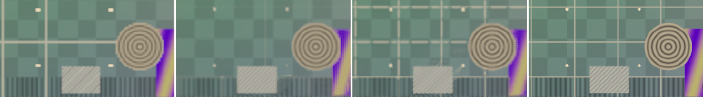
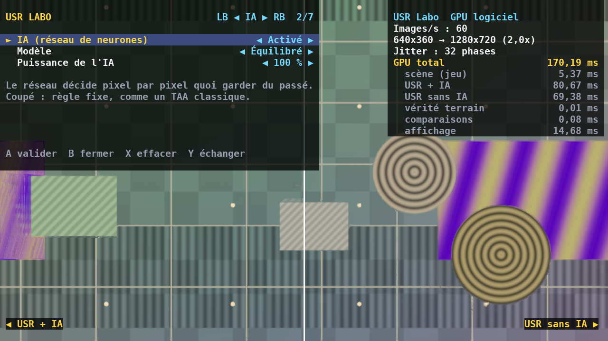

# USR — Usine Super Résolution

**Un upscaler à réseau de neurones « à la DLSS », écrit pour le GPU de la
Xbox Series X** (AMD RDNA 2), qui tourne aussi sur tout PC Direct3D 12.

Le jeu rend en basse résolution (par exemple 1080p) avec un léger décalage
différent à chaque image ; USR accumule ces images grâce aux vecteurs de
mouvement et reconstruit l'image en haute résolution (4K). Un petit réseau
de neurones décide, pour chaque pixel, ce qu'il faut garder du passé et ce
qu'il faut prendre de l'image courante.

Deux modes :

- **USR** (les vecteurs de mouvement viennent du jeu) ;
- **USR Universel**, qui n'a besoin que de l'image : il estime lui-même
  le mouvement.

C'est ce second mode qui tourne dans **notre version de l'émulateur
Xenia** : les jeux Xbox 360 sur ta Xbox Series X, réglables en direct à
la manette.

---

## D'abord, trois vérités sur ta console

**1. Sa carte graphique.** La Xbox Series X a un GPU **AMD RDNA 2** conçu
sur mesure pour Microsoft : 52 unités de calcul à 1,825 GHz, 12 TFLOPS,
DirectX 12 Ultimate — la même famille que les Radeon RX 6000. Détails dans
[docs/XBOX-SERIES-X.md](docs/XBOX-SERIES-X.md).

**2. DLSS ne peut pas y tourner.** DLSS appartient à NVIDIA : code fermé,
réservé aux GeForce RTX et à leurs *Tensor Cores*, que le GPU AMD de la
Xbox n'a pas. DLSS 5 (septembre 2026) va encore plus loin : un modèle
génératif qui repeint éclairage et matières, intégré jeu par jeu par les
studios, sur RTX 50. D'où ce projet : **le principe de DLSS 2 à 4
(super-résolution par IA), en code ouvert, écrit pour RDNA 2**. (Et un
autre nom, « DLSS » étant une marque de NVIDIA.)

**3. On ne peut pas l'ajouter aux jeux Xbox du commerce.** La Xbox est
une plateforme fermée : les jeux sont signés et chiffrés, rien ne peut s'y
injecter sans pirater la console. USR s'intègre dans **tes propres jeux et
applications** DirectX 12. Il s'intègre aussi, grâce à l'émulation, dans
les **jeux Xbox 360 que Xenia fait tourner** : là, c'est l'émulateur qui
dessine l'image, et il est à nous.

| Où | Pour qui | Comment |
|---|---|---|
| Xbox en **mode Développeur** | tout le monde (compte gratuit) | application UWP DirectX 12 — voir **USR Labo** |
| Xbox en **mode Développeur** | jeux **Xbox 360** émulés | notre version de **Xenia**, avec USR Universel — voir [docs/XENIA.md](docs/XENIA.md) |
| Xbox via le **GDK** | studios inscrits (ID@Xbox) | jeu publié, shaders compilés par le dxc du GDK |
| **PC** Direct3D 12 | tout le monde | n'importe quel GPU AMD, NVIDIA, Intel |

---

## Résultats

Mesurés sur des scènes de test **jamais vues à l'entraînement** (mode
Performance, rendu 128x72 → affichage 256x144, 40 images, vérité terrain à
16 échantillons par pixel). PSNR : plus haut = plus fidèle ; scintillement :
plus bas = plus stable.

| Scène | Bilinéaire | USR sans IA | **USR avec IA** |
|---|---|---|---|
| 101, caméra fixe | 24,51 dB / 0,0006 | 25,32 dB / 0,0065 | **28,41 dB** / 0,0073 |
| 101, caméra mobile | 24,73 dB / 0,0398 | 25,14 dB / 0,0310 | **27,55 dB** / 0,0286 |
| 202, caméra fixe | 25,91 dB / 0,0008 | 25,78 dB / 0,0083 | **29,35 dB** / 0,0078 |
| 202, caméra mobile | 25,52 dB / 0,0354 | 25,34 dB / 0,0291 | **27,88 dB** / 0,0266 |



*De gauche à droite : bilinéaire, USR sans IA, **USR avec IA**, vérité
terrain (rendu 192x108 → 384x216, agrandi 3x). Sans IA, le recadrage
anti-fantômes efface la grille de lignes fines ; le réseau apprend à la
garder.*

Le réseau apporte **+2,4 à +3,6 dB** par rapport au même algorithme sans IA,
sans scintiller davantage. (Le bilinéaire ne « scintille » pas en caméra
fixe parce qu'il ne fait rien : pas de jitter, pas d'anticrénelage.)

À lire honnêtement : c'est une scène **synthétique** à petite résolution,
pas un vrai jeu, et rien n'a encore été mesuré sur une console. Voir
« Ce qui est vérifié » plus bas.

---

## USR Labo : l'essayer sur ta Xbox, avec tous les réglages

**USR Labo** est une application UWP pour la Xbox en mode Développeur (et
pour PC). Elle fait tourner USR en direct sur le GPU de la console, sur
une scène de test, et tout se règle à la manette : résolution, **puissance
de l'IA (0 à 300 %)**, modèle (Stable / Équilibré / Détail), mémoire,
anti-fantômes, netteté, jitter… avec écran partagé, loupe, vues de ce que
décide l'IA, et temps GPU de chaque étape.



Installation pas à pas et liste des réglages : [docs/LABO.md](docs/LABO.md).

---

## USR dans Xenia : les jeux Xbox 360 émulés

Notre propre version de **Xenia** (l'émulateur Xbox 360, version UWP pour
la Xbox en mode Développeur) agrandit l'image des jeux avec **USR
Universel** :

- **Vue + Menu** : menu pause, avec une section USR (l'activer, ouvrir
  les réglages) ;
- **Vue + RB** : réglages **en direct** (niveau, IA, force de l'IA,
  historique, anti-fantômes, netteté, carte de diagnostic). Le jeu
  continue et ne reçoit plus la manette tant que le panneau est ouvert ;
- **LT maintenue** : comparaison instantanée avec FSR 1 ;
- **niveau 2** : Xenia décale lui-même la scène 3D d'une fraction de
  pixel à chaque image, pour une vraie super-résolution ;
- **sortie native (DLAA)** : USR à la taille du jeu, puis FSR jusqu'à
  l'écran ;
- **génération d'images** : une image fabriquée entre deux images d'un
  jeu à 30 images/s. Mesures et limites dans
  [docs/GENERATION.md](docs/GENERATION.md) ;
- **mode capture** : de vraies séquences de jeu, avec leur vérité
  terrain, pour mesurer et entraîner USR sur la Xbox 360. De la manette
  au réseau réentraîné, sans PC : [docs/CAPTURE.md](docs/CAPTURE.md).

Livré en 6 correctifs appliqués par un script sur une version précise de
xenia-canary-uwp. Construction avec Visual Studio, installation sur la
console, commandes et réglages : [docs/XENIA.md](docs/XENIA.md).

**USR Universel** : mesuré sur une scène « jeu émulé » (HUD, écrans
animés, textures filtrées) jamais vue à l'entraînement, rapport 3 (720p →
4K) :

| | Spatial (type FSR 1) | USR Universel niveau 1 | **niveau 2** |
|---|---|---|---|
| caméra mobile | 26,44 dB / 0,836 | 26,59 dB / 0,820 | **27,08 dB / 0,864** |
| caméra fixe | 26,62 dB / 0,836 | 26,66 dB / 0,815 | **28,41 dB / 0,911** |

Honnêtement :

- le **niveau 1** (l'image seule) égale un bon agrandissement spatial,
  sans le dépasser ;
- le **niveau 2** apporte le vrai gain ;
- en mouvement, il scintille un peu plus que FSR 1.

Détails, protocole et limites : [docs/UNIVERSEL.md](docs/UNIVERSEL.md).

---

## Essayer en 2 minutes (sans Xbox, sans carte graphique)

```bash
cd super-resolution
pip install numpy
python -m usr_ref demo            # écrit resultats/comparaison.png
python -m usr_ref banc            # le tableau ci-dessus
```

`resultats/comparaison.png` montre côte à côte : bilinéaire, USR sans IA,
USR avec IA, et la vérité terrain.

Pour aller plus loin :

```bash
python -m usr_ref entrainer       # ré-entraîne le réseau (quelques minutes)
python -m usr_ref parite          # exécute les VRAIS shaders et compare
                                  # (pip install slangpy + pilote Vulkan)
python -m usr_ref universel-banc --rapide   # USR Universel (~7 min)
```

## L'intégrer dans un jeu (C++ / Direct3D 12)

```bash
cmake -B build -A x64       # Windows : trouve dxc dans le SDK Windows
cmake --build build --config Release
```

```cpp
#include <usr/usr.h>

usr::CreateDesc cd = {};
cd.device = device;
cd.displayWidth = 3840;  cd.displayHeight = 2160;
usr::GetRenderSize(usr::QualityMode::Performance, 3840, 2160,
                   &cd.renderWidth, &cd.renderHeight);      // 1920x1080
usr::Context* ctx;
usr::CreateContext(cd, &ctx);

// chaque image : décaler la projection avec usr::GetJitterOffset, rendre,
// puis
usr::Dispatch(ctx, dispatchDesc);   // couleur + profondeur + mouvement -> 4K
```

Toutes les conventions (jitter, vecteurs de mouvement, profondeur, états
des ressources) : [docs/INTEGRATION.md](docs/INTEGRATION.md). Sans
vecteurs de mouvement (émulateur, capture) : `usr::UniversalContext`, voir
[docs/UNIVERSEL.md](docs/UNIVERSEL.md).

## Comment ça marche

Trois passes compute (Shader Model 6.0) par image :

1. **Préparation** (résolution de rendu) — vecteurs de mouvement du voisin
   le plus proche, détection des zones découvertes par la profondeur ;
2. **Accumulation** (résolution d'affichage) — historique reprojeté,
   image courante reconstruite, recadrage anti-fantômes, et le **réseau**
   (10 → 16 → 16 → 2, 482 poids) qui arbitre pixel par pixel ;
3. **Accentuation** adaptative au contraste, retour en linéaire.

Le réseau ne dessine rien : il choisit entre des couleurs déjà calculées.
C'est ce qui le rend minuscule, rapide sur un GPU sans unités matricielles,
et incapable d'« halluciner ». Explication complète :
[docs/ALGORITHME.md](docs/ALGORITHME.md).

## Ce qui est vérifié, et ce qui ne l'est pas

Vérifié automatiquement (voir `tests/` et `.github/workflows/super-resolution.yml`) :

- l'algorithme de référence (NumPy) et son gain mesuré face au
  bilinéaire et à l'heuristique ;
- la rétropropagation du réseau (différences finies) et ses exports ;
- **les shaders HLSL compilent** avec DXC (DXIL SM 6.0, SM 6.2 en FP16,
  SPIR-V) sans avertissement ;
- **les shaders calculent la même image que la référence** : exécutés sur
  un GPU logiciel (Mesa llvmpipe, Vulkan), écart > 55 dB de PSNR, aux
  arrondis FP16 près ;
- la bibliothèque C++ se construit avec CMake en `-Wall -Wextra -Werror`
  (g++ et clang, avec les en-têtes DirectX ouverts de Microsoft) ;
- **l'application USR Labo pour Windows tourne vraiment** : compilée pour
  Windows (MinGW), exécutée sur Direct3D 12 via Wine + vkd3d-proton sans
  carte graphique, sa sortie est identique à la référence Python sur 60
  images (écart > 60 dB) — tout le code C++ Direct3D 12 de la
  bibliothèque est donc exercé ;
- **USR Universel** : même chaîne de vérification (référence, parité
  des shaders sur GPU logiciel, bibliothèque C++ sous Wine identique à la
  référence), et sa vue dans l'application Labo ;
- **Xenia + USR** : les 6 correctifs s'appliquent sur un clone neuf de
  l'émulateur, et le menu de réglages passe ses tests ;
- **compilation sous Windows avec MSVC** (intégration continue) : la
  bibliothèque, le Labo PC et le Labo **UWP**, et **Xenia** avec les
  correctifs, en version PC et en appli Xbox. Le paquet Xbox signé de
  Xenia USR est produit à chaque passage (artefact `xenia-usr-xbox`).

**Pas encore vérifié** — il faut une Xbox (ou un PC Windows) :

- l'exécution sur le vrai Direct3D 12 de Windows (seule la traduction
  vkd3d-proton a été utilisée) ;
- la compilation avec le GDK console et le fonctionnement sur Xbox ;
- les performances réelles (estimation : 1 à 2,5 ms en 4K sur Series X) ;
- la qualité sur un vrai jeu (le réseau n'a vu que la scène synthétique).

## Arborescence

```
super-resolution/
├── shaders/          les passes HLSL : USR (usr_*) et USR Universel
│                     (usr_u_*), le code qui tourne sur la Xbox
├── include/usr/      API C++ publique
├── src/              implémentation Direct3D 12 + poids par défaut
├── labo/             USR Labo : appli UWP (Xbox) et Win32 (PC), shaders
│                     de la scène de test, menu, police, icônes
├── xenia/            Xenia + USR : 6 correctifs, script d'application,
│                     cible CMake de la bibliothèque, tests du menu
├── usr_ref/          référence Python : algorithme, scène, entraînement
├── weights/          poids des 3 modèles et du réseau universel (.json
│                     lisible, .bin pour le GPU)
├── tests/            tests unitaires, cohérence, parité GPU, bout en bout
├── captures/         captures de vrais jeux, déposées depuis le téléphone
└── docs/             Xbox Series X, Labo, Xenia, USR Universel, DLAA et
                      génération d'images, captures, intégration, algorithme
```

## Feuille de route

- [x] Application de démonstration réglable à la manette (USR Labo)
- [x] USR Universel : sans vecteurs de mouvement (émulateurs, captures)
- [x] Xenia + USR : jeux Xbox 360, réglages en direct à la manette
- [x] Compiler Xenia + USR sous Windows (intégration continue, MSVC)
- [ ] Essayer Xenia + USR sur la console
- [ ] Mesures sur Xbox Series X (mode Développeur) et sur PC
- [x] Mode capture et chaîne d'entraînement sur de vraies captures
- [ ] Ré-entraînement sur de vraies captures de jeu (il faut les captures)
- [ ] Résolution dynamique
- [ ] Masque « réactif » pour particules et transparence
- [ ] Réseau en INT8 (`dot4add_i8packed`) pour les TOPS INT8 de RDNA 2
- [x] Génération d'images ×2 et sortie native (DLAA), mesurées
- [ ] Génération d'images : cadence et latence mesurées sur la console
- [ ] Ré-entraîner le réseau universel en incluant le rapport 1 (DLAA)

## Licence

MIT, comme le reste du dépôt. DLSS est une marque de NVIDIA Corporation,
Xbox une marque de Microsoft ; ce projet n'est affilié à aucune des deux.
