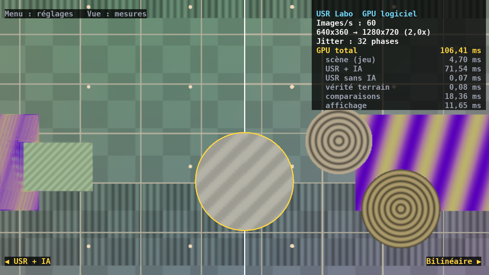

# USR Labo — l'appli pour essayer USR sur ta Xbox

USR Labo est une application **UWP** pour Xbox Series X|S en **mode
Développeur** (elle tourne aussi sur PC). Elle fait tourner USR en direct
sur le GPU de la console, sur une scène de test, et te laisse **tout
régler à la manette** : résolution, puissance de l'IA, modèle, mémoire,
anti-fantômes, netteté, jitter… avec comparaison côte à côte, loupe et
temps GPU de chaque étape.

Il montre aussi **USR Universel** : la même scène vue comme un émulateur
la voit (l'image finale seule, sans profondeur ni vecteurs de mouvement).
C'est le mode qui tourne dans Xenia ([XENIA.md](XENIA.md)), et le Labo est
le moyen de mesurer son coût GPU sur la console.


*Le menu (page « IA ») et les mesures. À gauche USR avec l'IA, à droite
sans : la grille de lignes fines tient à gauche, s'efface à droite.*



*Loupe x4 à cheval sur la séparation : USR + IA à gauche, simple
agrandissement bilinéaire à droite.*

> Ces deux captures viennent de la vraie application Windows, exécutée
> **sans carte graphique** sur la machine de développement (Direct3D 12
> traduit en Vulkan, GPU logiciel) : les temps affichés sont ceux d'un
> processeur qui imite un GPU, pas ceux d'une Xbox.

## Ce que le Labo n'est pas

- **Ce n'est pas un filtre pour tes jeux.** Il travaille sur sa propre
  scène de test. En mode Développeur, la console ne lance même pas les jeux
  du commerce, et aucune application ne peut lire l'image d'un autre jeu.
  Seule exception : les jeux Xbox 360 émulés, dont l'émulateur dessine
  lui-même l'image ([XENIA.md](XENIA.md)).
- **Ce n'est pas DLSS 5.** DLSS 5 (NVIDIA, septembre 2026) est un modèle
  génératif qui repeint l'éclairage, intégré jeu par jeu par les studios,
  sur cartes RTX 50. USR est un upscaler à IA du type DLSS 2 à 4 : il
  retrouve les détails d'une image calculée en basse résolution.

## Installer sur la Xbox, pas à pas

Il faut : la Xbox Series X ou S, un **PC Windows 10/11**, et le même
réseau local pour les deux (câble conseillé).

### 1. Passer la console en mode Développeur (une seule fois)

1. Sur le PC, créer un **compte développeur individuel** sur Microsoft
   Partner Center (gratuit pour les particuliers depuis 2025).
2. Sur la Xbox, installer l'application **Xbox Dev Mode** depuis le
   Microsoft Store, la lancer, et saisir le code affiché sur la page
   d'activation indiquée par l'application.
3. La console redémarre en mode Développeur et affiche **Dev Home**. Pour
   rejouer à tes jeux : bouton *Leave developer mode* dans Dev Home (tu
   peux passer d'un mode à l'autre quand tu veux).

### 2. Préparer le PC

1. Installer **Visual Studio 2022 Community** (gratuit) avec les charges
   de travail *Développement de jeux en C++* et *Développement
   d'applications Windows universelles* (cocher les *outils C++ pour la
   plateforme Windows universelle*), et le **SDK Windows 11 (10.0.22621)**
   ou plus récent.
2. Cloner ce dépôt, puis dans une *Developer Command Prompt for VS 2022* :

   ```bat
   cd super-resolution
   cmake -B build-uwp -A x64 -DCMAKE_SYSTEM_NAME=WindowsStore ^
         -DCMAKE_SYSTEM_VERSION=10.0.22621.0
   ```

   Si CMake ne trouve pas `dxc`, ajouter
   `-DUSR_DXC="C:\Program Files (x86)\Windows Kits\10\bin\10.0.22621.0\x64\dxc.exe"`.

### 3. Envoyer l'appli sur la console

1. Ouvrir `build-uwp\usr.sln`, choisir le projet **USRLabo** comme projet
   de démarrage, configuration **Release | x64**.
2. Propriétés du projet → *Débogage* : *Machine distante*, nom = l'adresse
   IP affichée dans Dev Home, authentification *Universal (Unencrypted
   Protocol)*.
3. **F5**. La première fois, Visual Studio demande un code : sur la
   console, Dev Home → *Pair with Visual Studio*.
4. **Important** : dans Dev Home, surligner *USR Labo* dans *Games &
   apps*, bouton **Affichage** de la manette → *View details* → *App
   type* : **Game**. En type « App », Windows ne lui laisse qu'environ
   45 % du GPU.

Sans Visual Studio connecté à la console : *Projet → Publier → Créer des
packages d'application* (distribution directe, « sideloading »), puis
installer le paquet `.msix` et ses dépendances depuis le **Device Portal**
de la console (`https://<IP de la Xbox>:11443`, bouton *Add*).

### Sur PC

La même application existe en version Windows classique :

```bat
cmake -B build -A x64
cmake --build build --config Release
build\Release\usr_labo.exe --largeur 1920 --hauteur 1080
```

## Les commandes

| Manette | Clavier (PC) | Action |
|---|---|---|
| Croix / stick gauche | Flèches | choisir un réglage, le changer (maintenir = accélère) |
| LB / RB | Maj+Tab / Tab | page précédente / suivante |
| A | Entrée | valider (actions, préréglages) |
| B | Échap | fermer le menu |
| Menu (≡) | F1 | afficher / masquer le menu |
| Affichage (⧉) | F2 | afficher / masquer les mesures |
| X | X | effacer l'historique |
| Y | Y | échanger gauche et droite |
| LT / RT | Q / E | déplacer la séparation |
| Stick droit | I J K L | déplacer la loupe |
| Clic stick droit | Z | loupe : coupée, x2, x4, x8 |

Menu fermé, la croix change directement les vues : ↑↓ la moitié gauche,
←→ la moitié droite.

## Tous les réglages

| Page | Réglage | Ce qu'il fait |
|---|---|---|
| Image | Mode d'agrandissement | Natif 1,0x · Qualité 1,5x · Équilibré 1,7x · Performance 2,0x · Ultra 3,0x · Personnalisé |
| | Rapport personnalisé | de 1,0x à 4,0x |
| | Netteté | accentuation finale, 0 à 100 % |
| | Jitter | le décalage sous-pixel ; coupé, la super-résolution disparaît |
| | Phases de jitter | Auto (8 × rapport²) ou 4 à 128 |
| IA | IA | réseau activé ou règle fixe (TAA classique) |
| | Modèle | Stable · Équilibré · Détail |
| | **Puissance de l'IA** | 0 à 300 % : 0 = sans IA, 100 % = tel qu'entraîné, au-delà = décisions amplifiées |
| Accumulation | Mémoire | 1 à 64 images accumulées |
| | Anti-fantômes | tolérance de l'historique (0,25 à 8) |
| | Finesse du noyau | 25 à 400 % |
| | Effacer l'historique | repartir de zéro |
| Universel | Niveau | 1 : image seule (émulateur qui ne touche pas au jeu) · 2 : jitter injecté (grille 2x2 / 3x3) |
| | Comparer avec / sans vecteurs | à gauche USR, à droite USR Universel |
| | Comparer à la vérité | à gauche USR Universel, à droite la vérité terrain |
| | Voir ce que décide l'IA | à droite, la réactivité de USR Universel |
| Comparaison | Moitié gauche / droite | USR + IA, USR sans IA, **USR Universel**, Bilinéaire, Vérité terrain, Entrée brute, diagnostics USR (alpha, bêta, confiance, désocclusion), Mouvement, diagnostics universels (réactivité, mémoire, doute du flot) |
| | Séparation | position de la ligne |
| | Loupe | coupée, x2, x4, x8 |
| Scène | Caméra, Objets, Vitesse, Pause | pour rendre la tâche facile ou difficile |
| | Vérité terrain | 1 à 16 échantillons par pixel |
| Préréglages | | Par défaut · Qualité maximale · Performance maximale · **IA à fond (300 %)** · Sans IA · Sans jitter · Comparer IA / sans IA · Voir ce que décide l'IA · **Avec / sans vecteurs** |

Les vues de diagnostic montrent ce que décide le réseau : *alpha* (clair =
il fait confiance à l'image courante, sombre = à l'historique), *bêta* (part
d'historique gardée sans recadrage), *confiance* (mémoire accumulée),
*désocclusion* (zones découvertes).

### USR Universel dans le Labo

Pour la vue **USR Universel**, le Labo rend la scène une seconde fois,
comme un émulateur la verrait :

- **niveau 1** : sans jitter ;
- **niveau 2** : avec le jitter que Xenia injecterait. C'est une grille
  2x2 en Performance et 3x3 en Ultra quand le rapport tombe juste (par
  exemple en 4K), une suite de Halton sinon.

Il la compresse ensuite pour l'écran, sur 8 bits. C'est **tout** ce que
reçoit USR Universel : ni couleur HDR, ni profondeur, ni vecteurs de
mouvement.

Il partage les réglages de USR :

- netteté ;
- IA (marche, puissance) ;
- mémoire ;
- anti-fantômes (rapporté à son propre défaut : 1,25 pour USR = 0,3 pour
  USR Universel).

Le modèle et la finesse du noyau ne concernent que USR.

Ses diagnostics :

- *réactivité* : clair = pixel refait à neuf, sombre = historique gardé ;
- *mémoire* : historique accumulé ;
- *doute du flot* : sombre = mouvement bien retrouvé, clair = aucune
  correspondance.

Le doute du flot s'allume normalement sur les bords d'objets qui
découvrent le décor et sur les lignes plus fines qu'un pixel.

La scène du Labo est échantillonnée sans filtrage (lignes plus fines qu'un
pixel) : c'est la plus dure pour un upscaler sans vecteurs. Sur ce genre de
scène, USR Universel reste proche d'un agrandissement bilinéaire (voir
[UNIVERSEL.md](UNIVERSEL.md), scène « brute »). Là où il brille, sur des
textures filtrées comme celles des jeux, il faut regarder les mesures de ce
document.

Dans les mesures (Vue), la ligne *Universel* rappelle le niveau et le
nombre de phases du jitter, et *USR Universel* donne son **temps GPU sur
la console**. C'est la mesure qui manque encore pour Xenia.

## Ce qui a été vérifié

- Les shaders du Labo (scène, vérité terrain, agrandissements,
  composition, texte) donnent la même image que leur version Python
  (`tests/test_labo.py`).
- Le cœur de l'appli (menu, réglages, préréglages, texte, animation de la
  scène) passe ses tests en C++ strict (`labo/tests/test_labo_core.cpp`).
- **L'application Windows elle-même** : compilée pour Windows, exécutée
  sur Direct3D 12 (Wine + vkd3d-proton, GPU logiciel), sur 24 images
  (`labo/tests/capture_wine.sh` + `tests/test_labo_bout_en_bout.py`) :
  - sa sortie USR est identique à la référence Python (écart > 55 dB
    exigé) ;
  - sa sortie **USR Universel** aussi, sur les mêmes images : image 8 bits
    reçue, jitter, remise à zéro.
- **La version UWP compile** avec MSVC dans l'intégration continue (C++20,
  manifeste complet).

Pas encore vérifié : la version UWP n'a pas encore été lancée sur une
vraie Xbox, et les performances sur console restent à mesurer. Si quelque
chose coince au déploiement, c'est là qu'il faudra regarder en premier.
